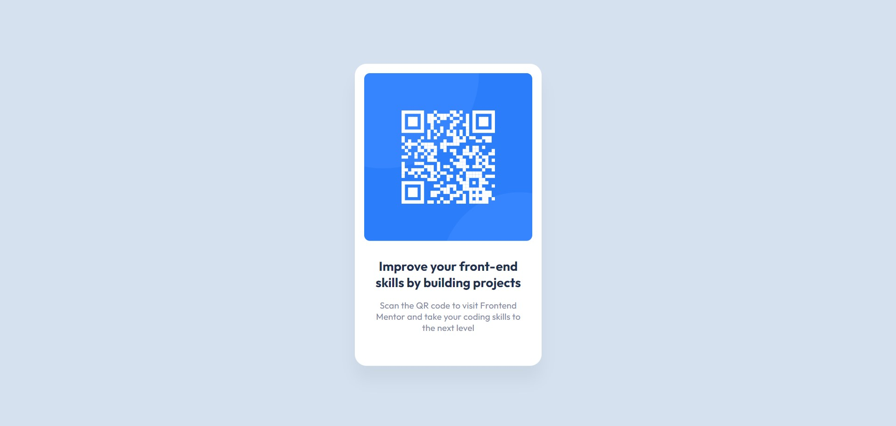

# qrcode
Created with CodeSandbox

# Frontend Mentor - QR code component solution

This is a solution to the [QR code component challenge on Frontend Mentor](https://www.frontendmentor.io/challenges/qr-code-component-iux_sIO_H).

## Table of contents

- [Overview](#overview)
  - [Screenshot](#screenshot)
  - [Links](#links)
- [My process](#my-process)
  - [Built with](#built-with)
  - [What I learned](#what-i-learned)
  - [Continued development](#continued-development)
  - [Useful resources](#useful-resources)
- [Author](#author)
- [Acknowledgments](#acknowledgments)

## Overview

### Screenshot

### Links

- Solution URL: [Add solution URL here](https://github.com/EkaAbashidze/qrcode)
- Live Site URL: [Add live site URL here](https://ekaabashidze.github.io/qrcode/)

## My process

### Built with

- Semantic HTML5 markup
- CSS custom properties

### What I learned

I learned to create a card, align it, its items and text in center, insert image,
make its overflow hidden, add colors to the whole background, text, and container.

### Continued development

I hope to create this kind of cards with ease in the future.

### Useful resources

Mostly I took upon from what I remembered was explained at the lecture, I did not
need to watch it again so I felt at ease with it, and then I added what was left for me to do.

## Author

- Website - [Add your name here](https://github.com/EkaAbashidze)

## Acknowledgments

It was a great explanation we had at the lecture, and hats off to the team of Bitcamp for making it an amazing first experience!
